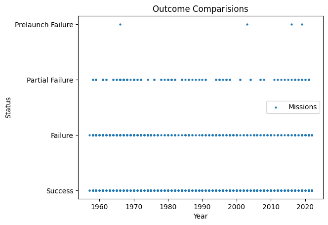

Rezaul Khan | Email: Khanrezaul77@gmail.com
### Exploratory Data Analysis and Programming Portfolio

# Project 1 | Space Missions Data Analysis | [Click here to see Code](https://github.com/Rkhan77/Rkhan77.github.io/blob/ee9d75ff2668e4b410689192c1f8477a5642d749/1957-2022%20Space%20Missions.ipynb)

## Description: 
This DataSet was scraped from https://nextspaceflight.com/launches/past/?page=1 and includes all the space missions since the beginning of Space Race (1957). In this project we explore space missions in history 

## Objective: 
To create a comprehensive dataset of all space missions since the beginning of the space race in 1957.

## Data Sources: 
The data for this project has been sourced from various reliable sources such as NASA, European Space Agency (ESA), Russian Space Agency (ROSCOSMOS), China National Space Administration (CNSA), and others. The data includes information on over 4000 space missions from various countries including the United States, Russia, China, Europe, and others.

## Data Fields: 
The dataset includes various data fields such as mission name, rocket name, launch site, date, company, outcome, and other relevant details.
Methodology: The data has been collected, compiled, and analyzed to create a comprehensive dataset of all space missions. The data has been verified for accuracy and completeness.

## Project Summary:
The purpose of this project was to analyze a dataset containing information about various rocket launches carried out by different companies at different locations. The dataset consisted of 4630 rows and 10 columns, with columns containing information about the company, location, date and time of launch, rocket used, mission, rocket and mission status, price, year of launch, and other relevant details.

## Data Preparation:
The data was loaded into a Pandas DataFrame and was found to be complete, with no missing or NaN values in any of the columns.
The data types of the columns were assigned appropriately, with categorical variables like "Company" and "Rocket" being assigned the "category" data type and date-time variables like "Date" being assigned the "datetime64[ns]" data type.

## Data Analysis Methods:
- The first step in the analysis was to generate some basic statistics about the dataset. This included calculating and also generating descriptive statistics.
- To gain insights into the distribution of the data, histograms, box plots, and scatter plots were generated for various columns.
- To gain a better understanding of the relationships between different variables, correlation matrices were created, and correlations between pairs of columns were calculated.
- To identify patterns and trends in the data, time series plots were generated for variables such as the number of launches by different companies over time.
Further, the data was aggregated based on different categories, such as the number of launches by different companies, the number of launches from different locations, and the number of launches of different rocket types.
- the data will be used to build predictive models that could be used to forecast the number of launches in future.

The analysis carried out in this project has provided valuable insights into the data. We have a better understanding of the distribution of the data, relationships between variables, patterns and trends. This information could be used by companies in the space industry to make informed decisions about their launch activities. This Space Mission Dataset provides a comprehensive overview of the history of space exploration and is a valuable resource for anyone interested in space history and technology.

## Introduction:
This report provides an analysis of the space missions launched by various countries between 1957 and 1978. The data analyzed includes the number of space missions launched by each country in a given year.

## Summary:
During the period from 1957 to 1978, there were a total of 564 space missions launched by various countries. The majority of these missions were launched by Russia (386), followed by the United States (197) and Kazakhstan (167).

## Analysis:
The United States launched its first space mission in 1957, with a total of 1 mission for the year. The number of missions launched by the United States increased over the years, reaching a peak of 60 missions in 1962, before declining in the later years. Overall, the data suggests that the United States has been the leading country in terms of the number of space missions, with an average of 35 missions per year. In comparison, China, India, and France have had a relatively smaller number of missions, with an average of 27, 3, and 8 missions per year respectively.

Kazakhstan started launching space missions in 1957 with a total of 2 missions for the year. The number of missions launched by Kazakhstan increased steadily over the years, reaching a peak of 43 missions in 1965, before declining in the later years. An interesting observation is that in recent years, countries like China, India, and Kazakhstan have been increasing their space mission capabilities. For instance, China's number of space missions has increased from 2 in 2013 to 55 in 2021. Similarly, India's space missions have increased from 2 in 2020 to 7 in 2022.

 
 

Russia started launching space missions in 1961, with a total of 2 missions for the year. The number of missions launched by Russia increased steadily over the years, reaching a peak of 72 missions in 1977, before declining in the later years. It is also noteworthy that countries like Russia and France have shown a relatively consistent performance over the years, with an average of 6 to 7 missions per year. It is worth mentioning that Pacific Ocean, Pacific Missile Range Facility, Shahrud Missile Test Site, and Yellow Sea have also been reported as locations for space missions. These locations may have been used for testing and launching missions, thereby indicating the importance of the oceanic regions in the field of space exploration.

In conclusion, the data suggests that the United States continues to be the leading country in space missions, followed by China and other countries that are increasing their capabilities in this field Other countries, including France, China, Japan, Australia, Kenya, and New Zealand, also launched a few space missions during this period. However, these countries collectively launched less than 50 missions during the period from 1957 to 1978.

Conclusion:
The analysis of the data shows that the majority of the space missions launched between 1957 and 1978 were by Russia, followed by the United States and Kazakhstan. While other countries also launched a few missions during this period, the number of missions launched by these countries was relatively low compared to the United States and Russia. The data provides a useful insight into the space exploration efforts of various countries during the period from 1957 to 1978.

# Project 2 | 5000+ US Companies Analysis Project

## Project Summary:
In this data analysis project, we worked with a data set that contained information about companies and their revenues. Our goal was to analyze the data and gain insights into the distribution of revenues across different industries and states.

We started by cleaning and transforming the data set to ensure that it was in a usable format for analysis. This involved removing any irrelevant columns and transforming the 'revenue' column from a string to a numerical value.

Next, we performed some exploratory data analysis to get a better understanding of the data. This involved plotting histograms, bar graphs, and other types of plots to visualize the distribution of revenues across different industries and states.

One key finding from our analysis was that the Advertising & Marketing industry was one of the highest-revenue industries in the data set. This was evident from our bar graph, which showed that states such as California, New York, and Texas had a high concentration of companies in this industry and were also generating the highest revenues.

We also found that there were a few outliers in the data set that were generating a significantly higher revenue than the rest of the companies. These outliers could have skewed the distribution of revenues and impacted our analysis.

In conclusion, this data analysis project provided valuable insights into the distribution of revenues across different industries and states. Our findings suggest that the Advertising & Marketing industry is one of the highest-revenue industries in the data set and that states such as California, New York, and Texas are key contributors to this revenue. This information could be useful for businesses that are looking to expand into high-revenue industries or geographic locations.

# Project 3 | Customer Booking Program 

## Description: 
This program will prompt for and read in person’s first and the last name on command line interface (CLI). it prompts to read the customer’s license number. The customer’s name and license number will be stored in different variables. The program will then output the name in a prompt to input the number of days that a customer wants to hire a car. The days of hire should be declared/assumed as an integer i.e., int. After all inputs (don’t forget to hit the Enter button on the keyboard), the program will execute and display the summary of hire including the rental. This project was part of my academic assessment. This project was important to me because it helped to learn how to code in Python. Thank you for taking the time to check out my project!

# Project 4 | Wordle Game 

## Description: 
This program is a single-player simple word game on commmand line interface(CLI), where the user enters as many words as they are able to think of using a selection of 9 letters. The user can play the game in “easy mode” or “hard mode”. This project was part of my academic assessment. The program first selects 9 letters of the alphabet at random. The same letter can appear multiple times, and the selection process uses the frequency of letters in the game of Scrabble when choosing letters, so that the 9 letters chosen are more likely to contain letters that are common in English words, e.g. the letters are much more likely to contain “E”, “I” or “A” than “Z”, “Q” or “X”. This project was important to me because it helped to learn how to code in Python. Thank you for taking the time to check out my project!

