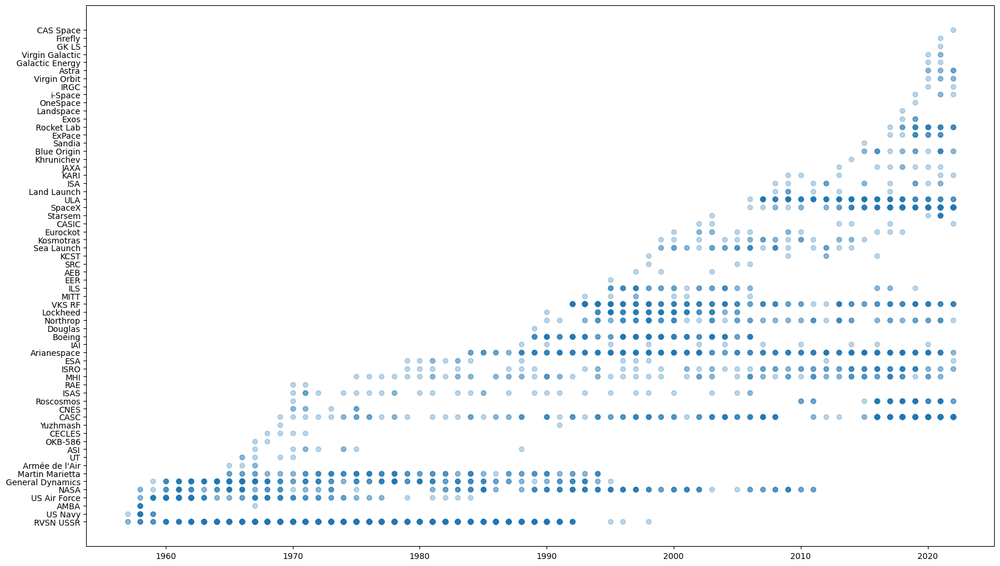
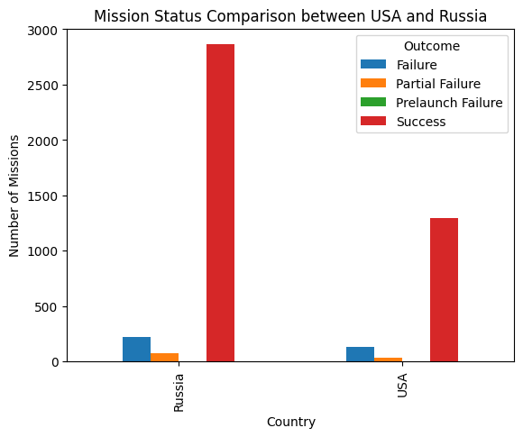

# Rezaul Khan
Explortory Data Analysis
Khanrezaul77@gmail.com

# Project 1| Space Missions Data Analysis

## Description: 
This DataSet was scraped from https://nextspaceflight.com/launches/past/?page=1 and includes all the space missions since the beginning of Space Race (1957). In this project we explore space missions in history 

## Objective: 
To create a comprehensive dataset of all space missions since the beginning of the space race in 1957.

## Data Sources: 
The data for this project has been sourced from various reliable sources such as NASA, European Space Agency (ESA), Russian Space Agency (ROSCOSMOS), China National Space Administration (CNSA), and others. The data includes information on over 4000 space missions from various countries including the United States, Russia, China, Europe, and others.

## Data Fields: 
The dataset includes various data fields such as mission name, rocket name, launch site, date, company, outcome, and other relevant details.
Methodology: The data has been collected, compiled, and analyzed to create a comprehensive dataset of all space missions. The data has been verified for accuracy and completeness.

## Project Summary:

The purpose of this project was to analyze a dataset containing information about various rocket launches carried out by different companies at different locations. The dataset consisted of 4630 rows and 10 columns, with columns containing information about the company, location, date and time of launch, rocket used, mission, rocket and mission status, price, year of launch, and other relevant details.

## Data Preparation:

The data was loaded into a Pandas DataFrame and was found to be complete, with no missing or NaN values in any of the columns.
The data types of the columns were assigned appropriately, with categorical variables like "Company" and "Rocket" being assigned the "category" data type and date-time variables like "Date" being assigned the "datetime64[ns]" data type.

## Data Analysis Methods:

- The first step in the analysis was to generate some basic statistics about the dataset. This included calculating and also generating descriptive statistics.

- To gain insights into the distribution of the data, histograms, box plots, and scatter plots were generated for various columns.

- To gain a better understanding of the relationships between different variables, correlation matrices were created, and correlations between pairs of columns were calculated.

 

- To identify patterns and trends in the data, time series plots were generated for variables such as the number of launches by different companies over time.
Further, the data was aggregated based on different categories, such as the number of launches by different companies, the number of launches from different locations, and the number of launches of different rocket types.
 
  

- Finally, the data was used to build predictive models that could be used to forecast the number of launches in future.

## Conclusion:
The analysis carried out in this project has provided valuable insights into the data. We have a better understanding of the distribution of the data, relationships between variables, patterns and trends. This information could be used by companies in the space industry to make informed decisions about their launch activities.

This Space Mission Dataset provides a comprehensive overview of the history of space exploration and is a valuable resource for anyone interested in space history and technology.

